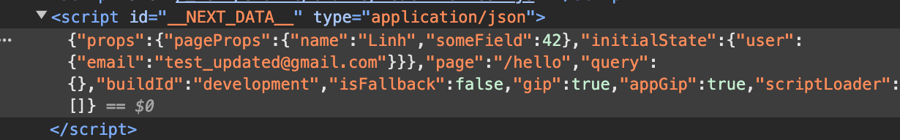

# How `getInitialProps` work

It runs in both server and client:

- Run only on the server at the initial page load.
- Run on client if we make client-side navigation to other parts of your application through the `<Link>` and come back
  to the page using `getInitialProps`.

Let's say we have below pages:

```tsx
function MyApp({Component, pageProps}: AppProps) {
    return <Component {...pageProps} />;
}

MyApp.getInitialProps = async (context: AppContext): Promise<AppInitialProps & any> => {
    const ctx = await App.getInitialProps(context)
    return {...ctx, example: 'data'}
}
export default MyApp

const Hello = () => {
    return (
        <div>Hello</div>
    );
};
Hello.getInitialProps = async (context: NextPageContext) => {
    return {name: 'Linh'}
}
export default Hello
```

The flow will be:

```
MyApp.getInitialProps → Hello.getInitialProps → MyApp render → Hello render
```

**Note that:** Each time we navigate to other page by using `<Link>` above flow will run again. That means `MyApp`
re-render

# Install

```shell
# https://github.com/kirill-konshin/next-redux-wrapper/blob/8.x/packages/demo-redux-toolkit/package.json
yarn add @reduxjs/toolkit react-redux next-redux-wrapper
```

# How `next-redux-wrapper` work

Let's say we have below snippet:

```tsx

type MyAppProps = Omit<AppProps, 'pageProps'> &
    PageInitialProps &
    { someField: number } &
    { initialState: AppState }

/**
 * MyAppProps contains 2 importance fields:
 *   - pageProps: Data return from appCallback
 *   - initialState: Data of Redux store
 */
const MyApp = ({Component, ...rest}: MyAppProps) => {
    console.log('pageProps:', rest.pageProps);
    console.log('initialState:', rest.initialState);

    const {store, props} = wrapper.useWrappedStore(rest);

    return (
        <Provider store={store}>
            <h1>PageProps.id: {rest.pageProps.someField}</h1>
            <Component {...props.pageProps} />
        </Provider>
    );
};

interface PageInitialProps {
    pageProps: any // any is anything return from children.getInitialProps (Hello.getInitialProps)
}

const appCallback: AppCallback<any, any> = store => async (appCtx): Promise<PageInitialProps> => {
    // childrenInitialProps.pageProps → { name: 'Linh' }
    const childrenInitialProps: PageInitialProps = await App.getInitialProps(appCtx);

    if (appCtx.ctx.req) {
        // If that process runs in server, we need to wait all thunk run complete
        // await allThunksPromise()
    }

    // { name: 'Linh', someField: 42 }
    return {
        pageProps: {
            ...childrenInitialProps.pageProps,
            someField: 42,
        },
    };
}
/**
 * wrapper.getInitialAppProps will:
 *   - Create store
 *   - Invoke appCallback
 *     - appCallback will invoke Hello.getInitialProps → update some data in store's state
 *   - Then return { initialState: AppState, pageProps: Return type of appCallback}
 *   @see wrapper.getInitialAppProps
 *   @see wrapper.makeProps
 */
MyApp.getInitialProps = wrapper.getInitialAppProps(appCallback)
```

```
Run wrapper.getInitialAppProps. Call as makeProps phase. See: wrapper.makeProps
    Create store with default state
    Run MyApp.getInitialProps and Child.getInitialProps
    Store's state will be updated. 
        If running in serer we must wait all thunk run complete
    Pass data to MyApp as props: 
        { 
          pageProps: Data return from MyApp.getInitialProps
          initialState: State of redux store, 
        }
Render MyApp
    Run wrapper.useWrappedStore;
        Create store with default state
        Dispatch __NEXT_REDUX_WRAPPER_HYDRATE__ action with payload is initialState above
Send to client
    Serialize MyApp's props to json
    Put to `<script id="__NEXT_DATA__" type="application/json">`
```

## Server-side render

1. Server: `wrapper.getInitialAppProps`

* Create Store with initial state
* Run app callback
    * Invoke `appCallback` → `Hello.getInitialProps`
    * Above process will dispatch some actions → add some data into Store's state
* Store's state now has data from `appCallback` and `Hello.getInitialProps`
* If we config debug we can see log:
    * `1. getProps created store with state <initial_state> ({ user: { name: 'Linh' } })`
    * `3. getProps after dispatches has store state <state_after_dispatch_some_action>  { user: { name: 'Pham' } }`
* Then return `{initialState: ReduxAppState, pageProps: Return type of appCallback}`

```tsx
const getInitialAppProps = (appCallback) => {
    const {initialProps, initialState} = await makeProps();
    return {
        ...initialProps,
        initialState,
    };
}

const makeProps = async () => {
    const store = initStore({context, makeStore});

    if (config.debug) console.log(`1. getProps created store with state`, store.getState());

    const initialProps = appCallback(context)

    if (config.debug) console.log(`3. getProps after dispatches has store state`, store.getState());

    return {
        initialProps, initialState: store.getState(),
    };
};
```

2. Server: Render MyApp

* MyApp's props is data return
  from `wrapper.getInitialAppProps`: `{initialState: ReduxAppState, pageProps: Return type of appCallback}`
    * Above data will render as JSON inside script element `<script id="__NEXT_DATA__" type="application/json">`
      then send to client
* `wrapper.useWrappedStore`
    * Create store with the `initialState` field of MyApp's props
    * Dispatch an action `__NEXT_REDUX_WRAPPER_HYDRATE__` with `payload` contains `initialState`
        * The reducer will fill all data from payload into state

3. Client: Render MyApp

* Don't run `wrapper.getInitialAppProps`
* MyApp will receive props from `<script id="__NEXT_DATA__" type="application/json">`
* Run `wrapper.useWrappedStore`
* Create new store with default state
* Dispatch an action `__NEXT_REDUX_WRAPPER_HYDRATE__` with `payload` contains data of MyApp's props




